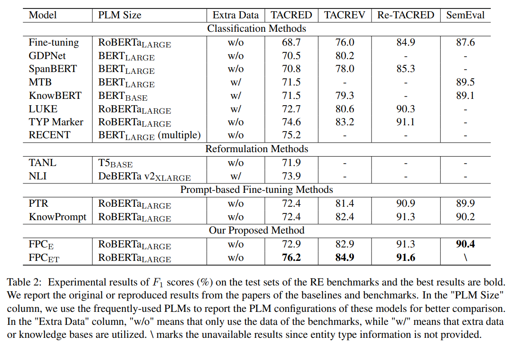
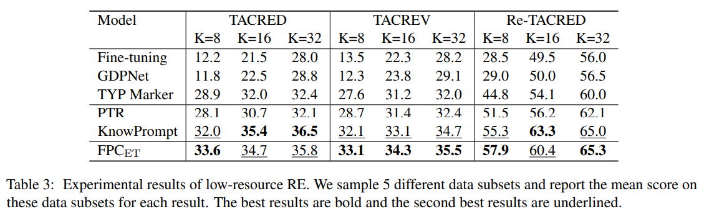

# FPC

This repository contains the source code of the AACL 2022 paper: [FPC: Fine-tuning with Prompt Curriculum for Relation Extraction](https://aclanthology.org/2022.aacl-main.78/).

If you use our code or you find our paper is related to your work, please kindly cite our paper:

```
@inproceedings{yang2022fpc,
  title={FPC: Fine-tuning with Prompt Curriculum for Relation Extraction},
  author={Yang, Sicheng and Song, Dandan},
  booktitle={Proceedings of the 2nd Conference of the Asia-Pacific Chapter of the Association for Computational Linguistics and the 12th International Joint Conference on Natural Language Processing},
  pages={1065--1077},
  year={2022}
}
```

## Overview

In this paper, we propose a novel method **Fine-tuning with Prompt Curriculum (FPC)** for relation extraction (RE).

* The **relation prompt learning (RPL)** introduces the cloze-style auxiliary task, through which the model can capture the semantics of relation labels.

* The **prompt learning curriculum (PLC)** makes the model adapt to the multi-task setting by learning the increasingly difficult sub-task, which makes the model build the connection between the targets of classification and MLM.

## Reqirements

* Install Anaconda and create the specific conda environment.

```
conda create -n FPC_env python=3.8
conda activate FPC_env
```

* Install pytorch and transformers with pip or conda.

```
conda install pytorch torchvision torchaudio cudatoolkit=10.2 -c pytorch-lts
pip install transformers==4.10.3
```

## Datasets

Extensive experiments have been conducted on four popular RE benchmarks.

* [TACRED](https://nlp.stanford.edu/projects/tacred/)

* [TACREV](https://github.com/DFKI-NLP/tacrev)

* [Re-TACRED](https://github.com/gstoica27/Re-TACRED)

* [SemEval](https://github.com/thunlp/OpenNRE) (We follow the data split of OpenNRE)

## Directory

```
|
├─ data
|   ├─ __init__.py
|   ├─ Data_tac.py
|   ├─ Data_setting.py
|   └─ Data_semeval.py
|
├─ model
|   ├─ __init__.py
|   └─ Model_roberta.py
|
├─ train
|   ├─ __init__.py
|   ├─ Evaluate.py
|   ├─ Train_base.py
|   ├─ Train_mlm.py
|   ├─ Train_mlmkg.py
|   └─ Train_mlmkg_2.py
|
├─ train
|   ├─ __init__.py
|   ├─ Metric.py
|   └─ Tools.py
|
├─ saved_data
|   ├─ tacred
|   ├─ tacrev
|   ├─ retacred
|   └─ semeval
|
├─ saved_model
|   └─ roberta_large
|
├─ saved_output
|
├─ figures
|   ├─ result1.png
|   └─ result2.png
|
├─ bash.sh
├─ config.py
├─ mainRE.py
├─ generate_k_shot.py
└─ README.md
```

## Arguments

```
--train                        action="store_true"
# train (for using the pre-trained parameters)
--evaluate                     action="store_true"
# evaluate (for using the trained parameters)

--dataset_name                 type=str, default="tacred"
# set the dataset to ["tacred", "tacrev", "retacred", "semeval"]
--template                     type=str, default="Simple"
# set the template of RPL to ["Simple", "Ent", "Typ", "EntTyp"]
--max_seq_len                  type=int, default=512

--folder_name                  type=str, default="exp_1"
# set the output folder name (for saving different outputs)
--downloaded_model             action="store_true"
# use the downloaded model files in the corresponding folder
--use_gradient_checkpoint      action="store_true"
# set gradient_checkpointing in the model configuration to True
--model_train                  type=str, default="base"
# set the training method to ["base", "mlm", "mlmkg", "mlmkg_2"]
--mlm_ratio                    type=float, default=0.4
# for RPL, set the weight of MLM loss in the total loss
--num_guide_epochs             type=int, default=5
# for PLC, set the curriculum schedule controlled by training epoch

--train_batch_size             type=int, default=32
--eval_batch_size              type=int, default=32
--gradient_accumulation_steps  type=int, default=2
--num_workers                  type=int, default=4

--num_train_epochs             type=int, default=5
--learning_rate                type=float, default=3e-5
--warmup_step_ratio            type=float, default=0.1
--weight_decay                 type=float, default=1e-5
--adam_epsilon                 type=float, default=1e-8
--max_grad_norm                type=float, default=1.0

--device                       type=str, default="cuda"
# set the device to ["cpu", "cuda"]
--seed                         type=int, default=42
--logging_steps                type=int, default=100
--eval_steps                   type=int, default=500
--save_model                   action="store_true"
# save the parameters of the trained model
```

## Running

1. Modify `config.py` to set the paths.

2. Download the datasets of [TACRED](https://nlp.stanford.edu/projects/tacred/), [TACREV](https://github.com/DFKI-NLP/tacrev), [Re-TACRED](https://github.com/gstoica27/Re-TACRED), [SemEval](https://github.com/thunlp/OpenNRE) to the corresponding folders.

* Set the dataset file names to `train.json`, `dev.json`, `test.json` for TACRED, TACREV, Re-TACRED and `semeval_train.txt`, `semeval_val.txt`, `semeval_test.txt` for SemEval.

3. Download the model of [roberta-large](https://huggingface.co/roberta-large) to the corresponding folder.

4. Modify `bash.sh` to set the arguments.

* **downloaded_model**: We set this to use the downloaded model files in the corresponding folder, otherwise the model files will be automatically downloaded to the cache directory.
* **use_gradient_checkpoint**: We set gradient_checkpointing in the model configuration to True to reduce the memory usage of GPU.
* **model_train**: We use the different training methods to get the results:
  * `base` for TEMP
  * `mlm` for RPL
  * `mlmkg` for RPL + PLC
  * `mlmkg_2` for RPL + I$\alpha$C
* **gradient_accumulation_steps**: We use gradient accumulation to expand batch size, which can reduce the memory usage of GPU.

5. Run `bash.sh` to conduct experiments.

6. Run `generate_k_shot.py` to generate data for low-resource RE.

## Results

The experimental results show that FPC achieves the new state-of-the-art performance for fully supervised RE and the competitive or best performance for low-resource RE.





We have conducted experiments on Ubuntu 18.04 using one NVIDIA Tesla V100 GPU and found the reported hyperparameters can bring the overall best results.
